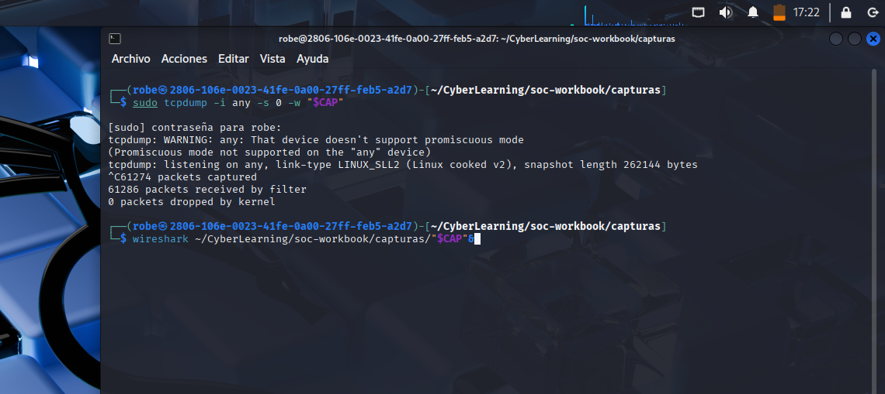
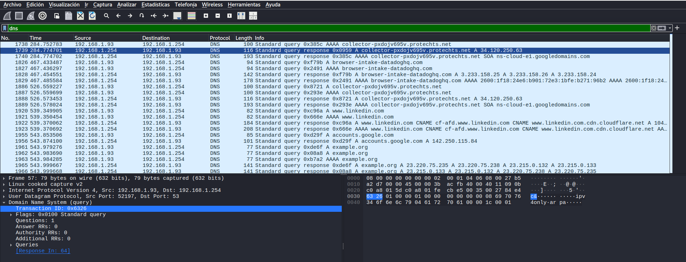
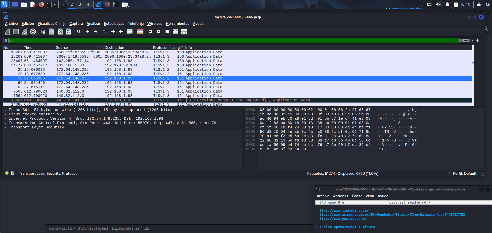
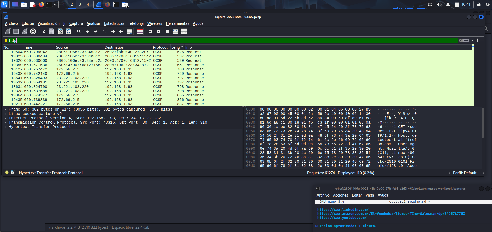

# Captura de tráfico de red con tcpdump y Wireshark

Fecha: 		5 de octubre de 2025  
Archivo: 	captura_20251005_163407.pcap  
Herramientas: 	tcpdump  y Wireshark  
Sistema: 	Kali Linux

---

## Objetivo
Capturar tráfico real de mi máquina mientras navego por sitios comunes y analizar los principales protocolos involucrados (DNS, TCP, TLS y HTTP).  
El propósito es entender cómo fluye la comunicación en la red y qué papel tiene cada protocolo dentro del proceso.

---

## Procedimiento
1. Abrí mi terminal en Kali y ejecuté el comando:
    
    sudo tcpdump -i any -s 0 -w "$CAP"

   Esto comenzó la captura de todo el tráfico desde cualquier interfaz.  
   Navegué por sitios como **LinkedIn**, **Amazon** y **YouTube** durante aproximadamente un minuto.

2. Cuando terminé, presioné `Ctrl + C` para detener la captura.  
   El sistema mostró que se habían capturado más de **61,000 paquetes** sin pérdida de datos.

3. Abrí el archivo en Wireshark con:

    wireshark ~/CyberLearning/soc-workbook/capturas/"$CAP"
   WIRESHARK Analysis](./wireshark.png)
   

5. En Wireshark, utilicé filtros para observar diferentes tipos de tráfico:
   - dns
   - tcp
   - tls
   - http

---

## Análisis por protocolo

### 🔹 DNS (Domain Name System)
Observé varias consultas desde mi máquina local (**192.168.1.93**) hacia el servidor DNS del router (**192.168.1.254**).  
Entre los dominios consultados estaban:

- example.org  
- accounts.google.com  
- www.linkedin.com  
- collector-pxdojv695v.protechts.net (servicio automático usado por navegadores o antivirus)

Cada consulta fue respondida correctamente con direcciones IP válidas, lo que indica que el sistema resolvió nombres sin errores.

---

### 🔹 TCP (Transmission Control Protocol)
El análisis mostró el establecimiento de conexiones entre mi equipo y servidores externos en los puertos **80 (HTTP)** y **443 (HTTPS)**.  
Pude identificar el **proceso de tres pasos (SYN, SYN-ACK, ACK)** típico del handshake TCP.

Esto confirma que las conexiones se establecieron correctamente y que no hubo retransmisiones ni fallos.

---

### 🔹 TLS (Transport Layer Security)
Luego del handshake TCP, se observaron varios paquetes con el protocolo **TLSv1.3**, donde mi equipo se conectó a direcciones como:

- 172.64.148.235 (servidores de Mozilla/Cloudflare)  
- 44.215.141.185 (Amazon Web Services)

En uno de los paquetes aparecía un **Client Hello**, que inicia el proceso de cifrado.  
Esto indica que la comunicación se estableció de forma segura usando HTTPS.

---

### 🔹 HTTP (Hypertext Transfer Protocol)
Finalmente, filtrando por http, encontré peticiones sin cifrar (puerto 80) hacia:
- detectportal.firefox.com, con una solicitud:

    GET /success.txt?ipv4 HTTP/1.1

  Esta petición es legítima: Firefox la usa para verificar si hay conexión a Internet.

El tráfico HTTP se mostraba completamente visible, confirmando que el contenido viaja en texto claro cuando no hay cifrado.

---

## Conclusión
Esta práctica me ayudó a comprender la relación entre los distintos protocolos que intervienen cuando navego por Internet.  
Aprendí a identificar:
- Cómo mi máquina resuelve dominios con DNS.  
- Cómo se establecen las conexiones TCP y luego se protegen con TLS.  
- Qué aspecto tiene un paquete HTTP en texto plano.

También confirmé que puedo capturar, guardar y analizar tráfico real sin errores.  
Fue interesante ver que **cada paquete cuenta una historia**, y que al entenderla puedo distinguir entre tráfico normal y algo que no debería estar ahí.

---

## Reflexión personal
Antes de hacer esta práctica conocía tcpdump y Wireshark muy basicamente. Sabía que servían para capturar y analizar tráfico, ya los había usado pero realmente no entendía qué mostraban ni su valiosa utilidad.  
Ahora me siento mucho más seguro. Ya me muevo con más confianza tanto en la terminal como en la interfaz de Wireshark.  
Lo que más me gustó es que empiezo a ver cómo todo se conecta: redes, protocolos y ciberseguridad ya no son cosas separadas, sino partes de lo mismo.  
Siento que este aprendizaje ya forma parte de mí, y eso me motiva a seguir aprendiendo hasta que todo esto me resulte algo natural.

