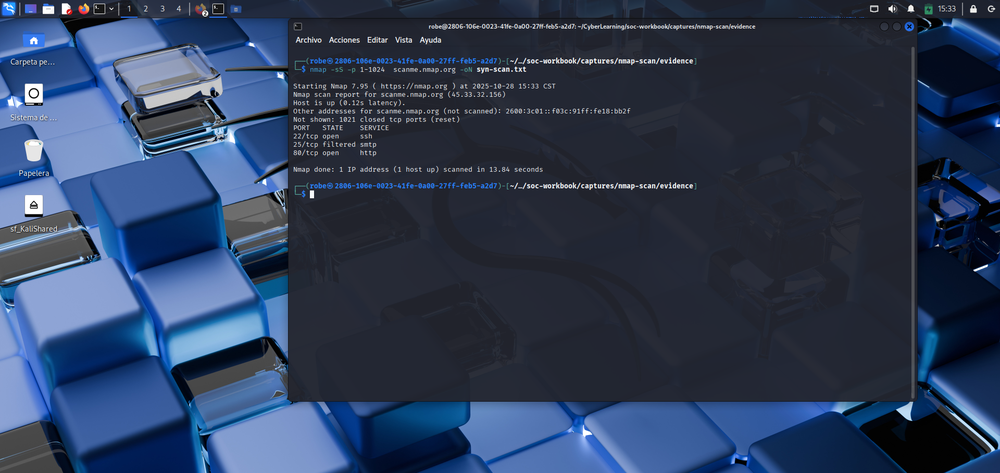
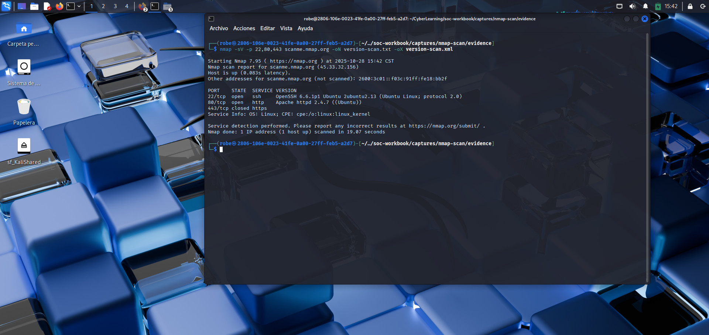
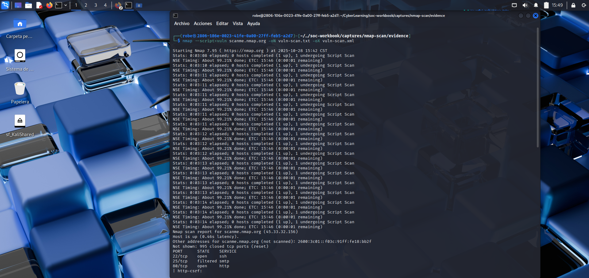
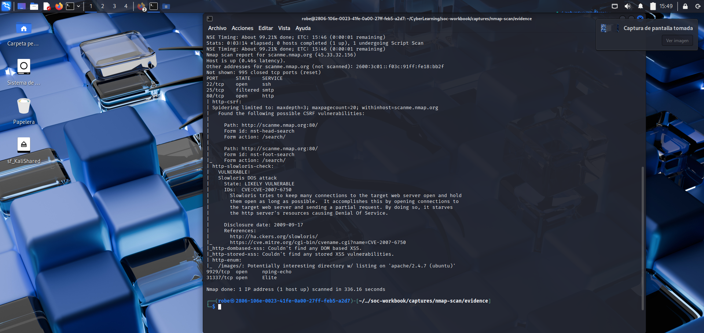

#  Practice: Network Scanning and Basic Vulnerability Detection

##  Objective
To learn how to discover active hosts, open ports, and running services using `Nmap`, while understanding how a SOC analyst interprets this data to identify potential threats or suspicious activity.

---

##  Commands used
```bash
nmap -sn 192.168.1.0/24               # Ping sweep: discover active hosts
nmap -sS -p 1-1024 192.168.1.10       # SYN scan for a specific host
nmap -sV -p 22,80,443 192.168.1.10    # Service version detection
nmap --script=vuln 192.168.1.10       # Run basic vulnerability scripts
nmap -sV 192.168.1.10 -oX nmap_report.xml
nmap -sV 192.168.1.10 -oN nmap_report.txt
```

---

##  Key Concepts
- Understanding **TCP/UDP scans** and how packets interact with the target.  
- Difference between **ping sweep**, **port scan**, and **version detection**.  
- Reading Nmap results: open, closed, filtered ports.  
- Using **NSE (Nmap Scripting Engine)** for vulnerability discovery.  

---

##  Steps and procedure
1. Launch `nmap` from the terminal in Kali Linux.  
2. Run different types of scans (ping, SYN, version detection, vuln).  
3. Export the results in `.txt` and `.xml` format.  
4. Save all evidence in:
   ```
   soc-workbook/captures/nmap-scan/evidence

   ```
5. Review the open ports and note which services are running (e.g., SSH, HTTP, HTTPS).  

---

##  Evidence

### 1️⃣ Nmap ping sweep

nmap -sn scanme.nmap.org

  
Output of nmap -sn (ping sweep). Confirms that the target host (scanme.nmap.org) is up and responsive.  

### 2️⃣ SYN Scan

nmap -sS -p 1-1024 scanme.nmap.org 

  
Result of a SYN scan (nmap -sS) for ports 1–1024. Shows open ports (e.g., 22, 80) and filtered ports.

### 3️⃣ Version Detection

nmap -sV -p 22,80,443 scanme.nmap.org

  
Output of the version scan (nmap -sV). Identifies services and versions (e.g., OpenSSH, Apache) to lookup associated CVEs.

### 4️⃣ Vulnerability Scripts

nmap --script=vuln scanme.nmap.org


  
Output of NSE vulnerability scripts (--script=vuln). Shows potential findings (e.g., Slowloris indicators and exposed forms). Treat as indicative — requires manual verification.

---

##  Conclusion
This exercise helped me understand how scanning tools like Nmap are used to explore and secure networks.  
By analyzing the results of each scan type, I learned how to identify active devices, open services, and potential weaknesses.  
Knowing how to interpret these patterns is an essential skill for both defensive (SOC) and offensive (ethical hacking) security work.

---

Javier A.
28/10/2025
